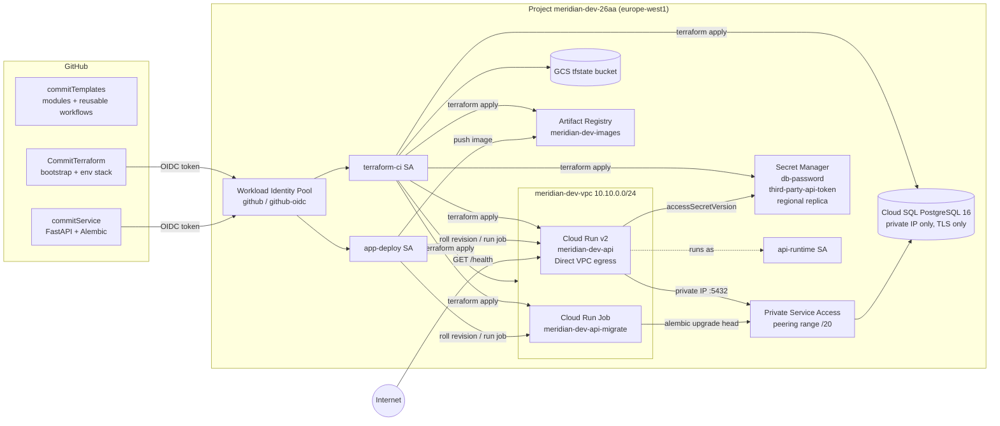

# Architecture

## Request path for `/health`

1. Cloud Run receives the request on its public HTTPS endpoint.
2. The handler opens a TLS connection to the Cloud SQL private IP through Direct VPC egress and runs `SELECT 1`.
3. The handler calls Secret Manager `accessSecretVersion` for the third-party token as the runtime service account.
4. Both results, the baked-in commit SHA, the region and the candidate name are returned. Any failure yields HTTP 503 with the reason in place of `ok`.

## Trust boundaries

| Identity | Can | Cannot |
|---|---|---|
| `terraform-ci` (from CommitTerraform only) | manage network, SQL, secrets, Run, AR, IAM in the project | create keys, read state of other envs, act outside the project |
| `app-deploy` (from commitService only) | push to AR, update Run service and job image, act as `api-runtime` | change network, IAM, secrets, create resources |
| `api-runtime` | read its two secrets | anything else; no Cloud SQL IAM role, access is by network path plus password |
| Reviewers | `roles/viewer` | read secret payloads, change anything |
